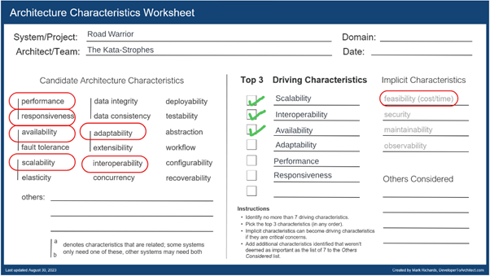

# Characteristics

[Home](../README.md) > [Architectural Approach](../README.md#architectural-approach) > Characteristics ( [Previous](../1-problem-background/2-key-requirements.md) / [Next](./2-style.md) )

To assess what architecture(s) would be the most appropriate to fulfill the requirements a set of architectural characteristics were identified with primary reference to the requirements.

## Scalability

This characteristic is a function of system capacity and growth over time; as the number of users or requests increase in the system, responsiveness, performance, and error rates remain constant. The direct requirement for this characteristic is “2 million active users per week” and “15 million total users”. Additionally, scalability is required to achieve performance, responsiveness and potentially availability requirements. The level of scalability required is significant and given that scalability is significantly impacted by architectural design this is identified as a driving characteristic.

## Interoperability

This characteristic relates to the ability of the system to interface and interact with other systems to complete a business request. The relevant requirement for this characteristic are “Poll email looking for travel-related emails (email integration)”, “The system must interface with the agency’s existing airline, hotel, and car rental interface system to update travel details“, and “Users should also be able to share their trip information by interfacing with standard social media sites or allowing targeted people to view your trip “ additionally integration is indicated in additional context. In relation to the size of the application, these integration requirements are a significant part of the system and consequently this is identified as a driving characteristic.

## Availability

This characteristic relates to the amount of uptime of a system. The relevant requirement for this characteristic is “Users must be able to access the system at all times (max 5 minutes per month of unplanned downtime)”. This corresponds to a 99.9885% uptime requirement. Uptime is greatly dependent upon physical machine uptime and can therefore be offloaded as part of an SLA with a hosting provider, however this level of system uptime is also significantly impacted by software architecture. Consequently, to achieve this requirement this characteristic is considered a driving characteristic.

## Adaptability

This characteristic relates to the ease in which a system can adapt to changes in environment and functionality. There are no direct requirements for this, however this characteristic is implied by the company being a ‘new startup’ and wanting to build the ‘next generation’ online trip management dashboard. As these are incidental requirements this is identified as a useful characteristic but not considered a driving characteristic.

## Performance

This characteristic relates to the amount of time it takes to perform a business request. The relevant requirement for this characteristic is “Updates must be in the app within 5 minutes of an update (better than the competition)”. This 5-minute requirement is deemed to require a modest level of performance rather than extreme performance, consequently performance is a consideration but is not a driving characteristic.

## Responsiveness

This characteristic relates to the amount of time it takes to get a response to the user. The relevant requirement for this characteristic is “Response time from web (800ms) and mobile (First-contentful paint of under 1.4 sec)”. A 1.4 second first contentful paint is considered a good / fast response time, this is a significant factor in engaging users and at the extreme end of slow response (beyond 3 seconds) results in users simply not using the application. Responsiveness is very influenced by the eventual application, elements such as compressing the logo image, optimizing javascript by deferring and delaying code and similarly optimizing CSS. There are some architectural considerations such as a good DNS provider that will also help with this but that do not impact the design of the architecture. With sensible consideration for such factors achieving the required responsiveness should be easily achievable as long as the system is able to scale such that these characteristics are not impacted under load. Consequently, whilst important, responsiveness is not highlighted as a driving characteristic.

## Feasibility (Cost/Time)

Feasibility is an implicit characteristic for architectural design i.e., it is a factor in all designs. There are no explicit requirements for feasibility, however, the company is a new startup. Statistically, 30% of new startups fail before the end of the second year and 50% fail before the end of year 5. Consequently, feasibility needs consideration throughout the project.

## Security

Security is an implicit characteristic, failure to consider this can have significant repercussions to the business. In relation to Road Warrior the data involved is not of a particularly sensitive nature and consequently security is of moderate consideration. It should be considered in specific impact areas.

## Maintainability

Maintainability is another implicit characteristic. The long-term implications of poor maintainability can be significant. It should be considered, and guidance provided.

## Observability

Observability is another implicit characteristic. Certain architectures (such as event driven) and certain requirements (such as big data) produce specific challenges in observability that may need mitigating if they are present.
