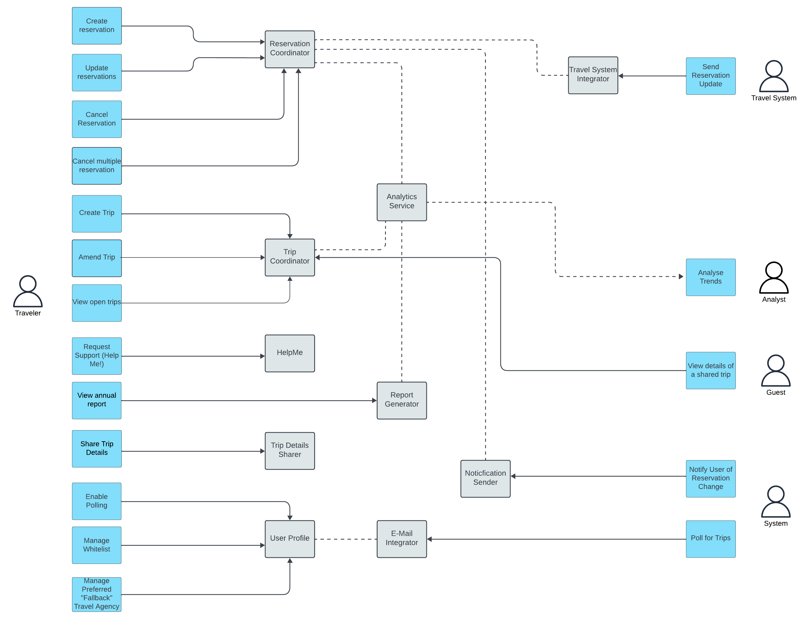

# Actors and Actions

[Home](../README.md) > [Solution Design](../README.md#solution-design) > Actors ( [Previous](../2-architectural-approach/2-style.md) / [Next](./2-components.md) )

We have gone through the Actors and Actions workshop to establish the actions and the components that the system will require.

| Actor | Description |
| ----- | ----------- |
| Traveler | Individuals who utilize the web application or the mobile application to access and interact with the system's travel-related features and services. |
| System | The encompassing term referring to all services and processes that are initiated and executed in response to events, as opposed to direct user interactions. This includes various backend microservices and event-driven components. |
| Analyst | Individuals who engage with the system primarily to access and utilize the data analytics functionalities, extracting valuable insights and information for analysis and decision-making. |
| External Travel System | Refers to external travel-related systems, such as Apollo or Sabre, which can interact with and integrate into the current system to enhance its functionality and capabilities related to travel services and information. |
