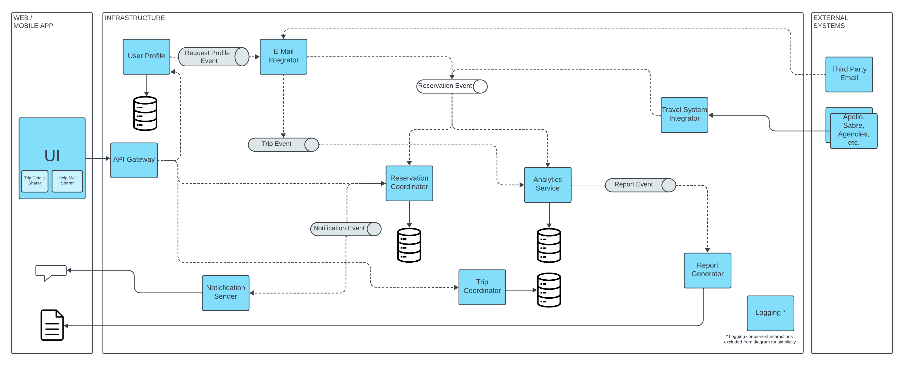

# Architecture Design

[Home](../README.md) > [Solution Design](../README.md#solution-design) > Architecture Design ( [Previous](./2-components.md) / [Next](./4-security.md) )

The architectural design is based on the Event Driven Serverless Microservices. The following diagram illustrates the components / microservices and the communication between them.

Event-Driven Microservices architecture leverages the strengths of both microservices and event-driven design, blending modularity and flexibility with real-time responsiveness and efficiency. Its foundation rests on three key principles: loose coupling, message-driven communication, and asynchronous processing. These principles synergize to construct a scalable, resilient, and high-performance distributed system.

Considering the architectural aspects, we previously discussed—scalability, interoperability, availability, and feasibility—we propose the use of serverless microservices as described in [ADR1: Use Event Driven Serverless Microservice Architecture](../4-decision-records/adr1-use-event-driven-serverless-microservice-architecture.md).

## Microservices

The following criteria was used to determine when a certain piece of functionality is to be considered a Microservice:

* The functionality must scale or be deployed independently from other parts.
* The functionality should have a clear and well-defined purpose or responsibility.
* The functionality can be written in a separate language/technology based on pragmatic considerations such as the expertise of the development team or the specific requirements of the service.
* The functionality must be isolated by a clean boundary.

Given the above principles, the following are identified as Microservices:

* User Profile
* E-Mail Integrator
* Trip Coordinator
* Reservation Coordinator
* Travel System Integrator
* Notification Sender
* Analytics Service
* Report Generator

## Event Broker

The Event Broker will be a central component in our event-based architecture responsible for receiving, managing, and routing events within a system. The application itself does not contain complex workloads that require orchestration, nor exchange messages. The architecture enables deploying one or multiple event brokers to ensure elasticity, scalability, and fault-tolerance during operations.

## Data Storage

Each microservice has its own database, ensuring data isolation as well as maintaining the bounded context, preserving autonomy (changes in the data models and schemes do not affect other microservices), each microservice can scale separately, and if needed each microservice can have different database type (relational, noSQL or other). All microservices will use noSQL databases.

## Front End Framework

The web application and the mobile application will be developed using a front-end framework that enables development of hybrid mobile applications, as explained in [AD3: Use hybrid technology for mobile app](../4-decision-records/adr3-use-hybrid-technology-for-mobile-app.md).

The user interface will be compliant with the latest W3C standards. It will be based on responsive design, that serves the content to multiple devices from the same codebase, making it easily maintainable. The application will be identical on the latest version of the most used browsers and mobile phones.

We've opted not to adopt a caching mechanism as part of the overall architecture, for reason mentioned in [ADR4: Do not implement shared caching](../4-decision-records/adr4-do-not-implement-shared-caching.md).
