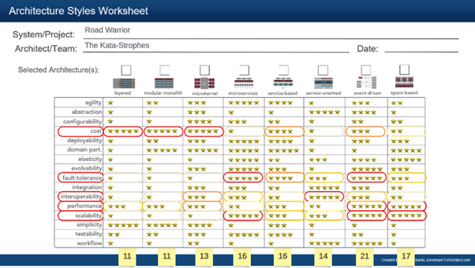

# ADR1: Use Event Driven Serverless Microservice Architecture

[Home](../README.md) > [Decision Records](../README.md#decision-records) > ADR1: Use Event Driven Serverless Microservice Architecture ( [Previous](../3-solution-design/4-security.md) / [Next](./adr2-use-an-existing-email-processing-service.md) )

## Status

* Adopted (14/09/2023)
* Proposed (14/09/2023)

## Context

New startup looking to produce an application with richest user experience possible for a large user base. The application has significant integration requirements.

The following 6 architectural characteristics have been identified as relevant to the solution: Scalability, Interoperability, Availability, Adaptability, Performance, and Responsiveness. As a subset of these characteristics, Scalability, Interoperability and Availability have been identified as driving Characteristics to achieve the desired goals. Of additional note, given that this is a new startup feasibility (specifically cost) is to be born in mind along with the driving characteristics.

## Evaluation Criteria

Architecture style is related to a subset of architectural characteristics. Within this subset the characteristics to evaluate against have been determined as those that have greatest influence over our driving characteristics. These are selected as: Fault tolerance, Interoperability, Performance and Scalability. Cost is also included in our evaluation criteria based on the additional consideration mentioned above.

The architecture style worksheet will be used to perform the evaluation which relates relevant characteristics to how well each style supports those characteristics. Evaluation will be primarily based on total points that each style scores across all the relevant characteristics. Further consideration will look at any low outlying scores for any individual characteristic to confirm if these are acceptable.

## Options Considered

Based on the architecture styles worksheet we identified the top 4 potential architecture styles based on total score: Event-Driven (21 points), Space Based (17), Service Based (16) and Microservices (16) as all providing good solutions for these driving characteristics. The lowest scores for these styles are: Event-Driven (3), Space Based (2), Microservices (2), and Service Based (2). In both evaluation criteria respects Event-Driven outperforms the other 3 considerations. The lowest scores are against cost (which is only an additional consideration) and interoperability for which the lower score of 3 is not felt to be significantly impactful such that it would cause any blockers.

The event-driven architecture style results in excellent separation of components within the application but this can still be implemented in different ways. For example, event-driven components could exist within a monolithic architecture or within a micro services architecture. The cost of implementing this with micro services is extremely low and gives improved scalability so this is felt to be an obvious extension of selecting the event-driven style.

Given that cost is an additional consideration it is worth bringing in one additional element of event-driven architecture, this can be deployed in either serverless or long running services. Serverless deployments allows the infrastructure to manage scalability dynamically where long running services are manually adjusted. With serverless deployments the tradeoff is between a small potential increase in time when cold services are being used vs reduced cost due to unused capacity being removed and consequently not charged for. Given the cost factor for consideration we recommend serverless deployment. By selecting serverless deployment it is an obvious choice to use an event broker rather than implementing independent queues so that the hosted event broker can handle scalability automatically.

## Decision

1. Adopt an event-driven architecture within our system.
1. Components that consume events will be written as micro-services and run serverless.
1. Use a hosted event broker.

## Implications

### Positive

* High scalability to respond to change in the user load.
* High Adaptability: You can easily add, remove, or modify microservices to respond to different events or event types.
* Cost-Efficiency: Serverless platforms often offer a pay-as-you-go pricing model, so you only pay for the compute resources used during the execution of each microservice.
* Event driven is more fault tolerant than would be possible via other architectures.

### Negative

* Potential for cold microservices workloads to impact the first-contentful paint where containers, once deployed, are typically available for immediate use, with lower startup latency.
* Increased complexity especially the debugging and troubleshooting challenges.
