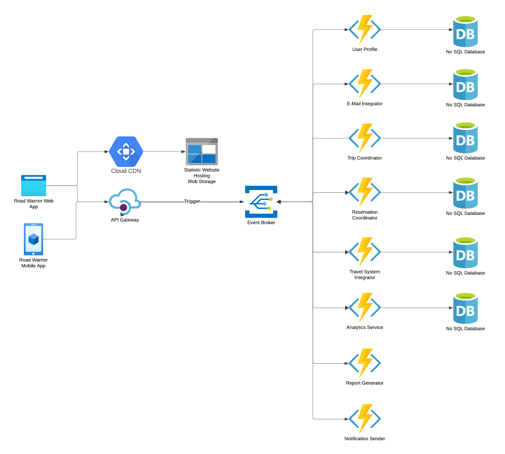

# Deployment and Operation

[Home](../README.md) > [Additional Considerations](../README.md#additional-considerations) > Deployment and Operation ( [Previous](../4-decision-records/adr6-use-a-separate-logging-component-for-event-correlation.md) / [Next](./2-technology-stack.md) )

The following diagram gives a graphical representation of a possible deployment scenario. Please note that the actual deployment strategy will be influenced by the selection 

The serverless microservices are implemented as functions (e.g., AWS Lambda, Azure Functions, Google Cloud Functions) that respond to specific events. These functions execute independently, and scale automatically based on demand. The scalability is completely managed by the cloud provider.

The Event broker (e.g., Azure Event Grid, AWS EventBridge, Apache Kafka) acts as a central hub for routing events to the appropriate serverless functions. It ensures that events are delivered reliably and according to defined rules.

Data Storage: Each microservice has its own database, ensuring data isolation as well as maintain the bounded context, preserve the autonomy (changes of the data models and schemes do not affect other microservices), each microservice can scale separately, and if needed each microservice can have different database type (relational, noSQL or other).

Monitoring and logging services will be used from the cloud providers to (e.g., AWS CloudWatch, Azure Monitor) provide insights into the performance and behavior of serverless microservices.

Continuous integration and continuous deployment (CI/CD) pipelines will be used to automate the deployment of serverless microservices, ensuring rapid and reliable updates.
